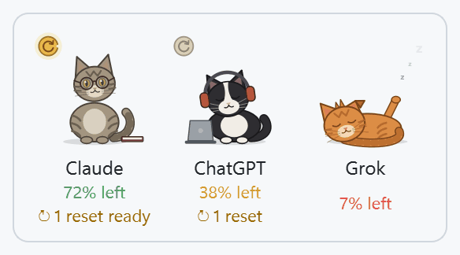

# Quota Tray

**See how much of your Claude, ChatGPT Codex and Grok subscription quota is left, from your Windows
tray or a desktop widget, without opening a single CLI.**



If you pay for Claude Pro/Max, ChatGPT Plus/Pro or SuperGrok and use their coding CLIs, you have
weekly and 5-hour limits that are easy to run into by surprise. Quota Tray shows what's left of each
one at a glance, when it resets, and whether you're on pace to run out. It's built and tested on
Windows 11 (Windows 10 should work but hasn't been tested).

**What it reads:** the logins that the official CLIs (**Claude Code**, **Codex CLI**, **Grok CLI**)
already keep on your PC. It uses them to ask each service the same usage question the CLI itself
asks for its own `/usage` or `/status` screen. There's nothing to configure and no API key or
cookie to paste.

**What it never does:**
- **No token writes.** It never writes, refreshes or rotates a CLI's login. It only reads it.
- **No prompts sent.** It never talks to a model, only to the usage and billing endpoints.
- **No quota spent.** Checking your usage doesn't use any of it.

It comes in two parts. Use either or both:

- **Quota Tray** (`QuotaTray.exe`): a tray icon colored by your lowest weekly % left. Hover it for
  one line per provider; click it for a panel of cards.
- **Quota Widget** (`QuotaWidget.exe`): a small see-through desktop widget with three looks:
  compact rows, full cards, or **cats**. In cats mode each provider is a cat whose energy follows
  your quota, from wide awake down to curled up asleep.

## Supported providers

| Provider | CLI whose login it reads | What it shows |
|---|---|---|
| Claude (Pro, Max) | Claude Code | Weekly and 5-hour limits, per-model weekly limits, Claude Code vs. Chats split |
| ChatGPT (Codex) | Codex CLI | Weekly Codex limit (and the 5-hour one when offered), banked resets |
| Grok | Grok CLI | Weekly limit, per-product usage |

**Gemini is not supported.** Google offers no supported way to read Gemini quota. (The usage
report does count Gemini CLI tokens from its local logs; that reads files on your PC, not a quota
API.)

## Quick start

1. Download `QuotaTray-<version>-win-x64.zip` from the [Releases](https://github.com/christrancoach/quota-tray/releases) page and unzip it
   anywhere. It holds both exes plus license files.
2. Run `QuotaTray.exe` or `QuotaWidget.exe`. Windows will probably show a SmartScreen warning the
   first time; see [SmartScreen](#smartscreen-windows-protected-your-pc) below.
3. Optional: right-click → **Install to this PC…** to copy both apps into
   `%LOCALAPPDATA%\Programs\QuotaTray`, add Start menu shortcuts and an *Apps & features* entry. It
   installs for your account only and needs no admin. Right-click → **Start with Windows** to launch
   at login.

You need at least one of the CLIs installed and logged in: `claude`, `codex` or `grok`. A provider
whose CLI isn't logged in shows "No … login found" and is otherwise ignored.

## Trust

A quota app reads your AI logins, so here is exactly what it does with them.

### Network calls

On by default. Each one is the endpoint the CLI itself calls, made with the CLI's own token and
this app's own User-Agent (`quota-tray/…`):

| When | Request | Why |
|---|---|---|
| Every 10 min (never more often than every 5 min per provider) | `GET api.anthropic.com/api/oauth/usage` | Claude usage, the same call Claude Code's `/usage` makes |
| Same | `GET chatgpt.com/backend-api/wham/usage` and `…/wham/rate-limit-reset-credits` | Codex usage and banked resets, calls the Codex CLI makes |
| Same | `GET cli-chat-proxy.grok.com/v1/billing?format=credits` and `…/v1/user?include=subscription` | Grok usage and plan name, calls the Grok CLI makes |
| When you open the usage report, at most weekly | `GET raw.githubusercontent.com/BerriAI/litellm/…/model_prices_and_context_window.json` | Public price list for cost estimates. Sends nothing about you |
| Daily | `GET api.github.com/repos/christrancoach/quota-tray/releases/latest` | "Update available" notice. It never downloads or runs anything |

**Keepalive (on by default, can be turned off):** Claude Code and Grok CLI logins expire after a
few hours and are renewed only when you use the CLI. Shortly before a login expires, the app runs
`claude doctor` or `grok models` (at most once an hour). These are the CLIs' own commands. They
send no prompt, use no quota, and let the CLI renew and save its own login. The app never touches
the refresh token. See [Keepalive](#keepalive).

Nothing else is sent anywhere: no telemetry, no analytics, no crash reports.

### What it stores

Everything stays in `%APPDATA%\quota-tray\` on your PC:

| File | Contents |
|---|---|
| `config.json` | Your settings |
| `state.json` | Last reading per provider, alerts already sent, keepalive runs. **No tokens** |
| `history.csv` | Timestamped usage percentages and reset times, used for the forecast |
| `usage.db` | Token counts per model call for the usage report. Numbers only, never prompt or reply text |
| `widget.json` | Widget position and look |
| `litellm_prices.json`, `pricing.json` | Cached price list and your optional price overrides |
| `debug.log` | Warnings and unexpected responses. Secrets are redacted to their first 6 characters; emails are removed |

### The one unofficial source (off by default)

**Claude banked resets via Claude Code client (unofficial).** Anthropic returns details of spare
limit resets only to Claude Code. To show them, the app sends Claude Code's User-Agent on that one
read-only request. Your Claude usage bars don't depend on it. This may violate Anthropic's terms and
can stop working at any time.

It's off unless you turn it on in **Settings → Unofficial sources**, which shows a warning first.
It's off because a public app shouldn't pose as another client by default. Whether the trade-off is
worth it is your call.

## SmartScreen ("Windows protected your PC")

The release exes are **not code-signed**. A signing certificate costs money every year, and
SmartScreen also trusts files by how many people have downloaded them, so a new, unsigned exe gets
a blue "Windows protected your PC" warning the first time it runs.

- **To run it anyway:** click **More info → Run anyway**. Windows remembers the choice for that file.
- **To check you have the real file:** compare its hash with `SHA256SUMS.txt` on the release page:
  ```powershell
  Get-FileHash .\QuotaTray.exe -Algorithm SHA256
  ```
- **To avoid trusting a binary at all:** [build from source](#build-from-source). It takes a few minutes.

## Build from source

You need Windows 11 (x64), [Python 3.12](https://www.python.org/downloads/) with the `py`
launcher (the python.org installer includes it) and Git.

```powershell
git clone https://github.com/christrancoach/quota-tray.git
cd quota-tray
.\build.ps1
```

`build.ps1`:
1. Creates `.venv` and installs the pinned requirements.
2. Runs the tests.
3. Builds `dist\QuotaTray.exe` and `dist\QuotaWidget.exe`, plus `dist\QuotaTray-<version>-win-x64.zip`
   and `dist\SHA256SUMS.txt`.

It stops at the first failure. If PowerShell refuses to run the script, run
`Set-ExecutionPolicy -Scope Process Bypass` in that window first.

To sign the exes, put a code-signing certificate in your certificate store, install the Windows SDK
(for `signtool.exe`) and set `QUOTA_SIGN_THUMBPRINT` to the certificate's SHA-1 thumbprint before
running `build.ps1`.

To run without building:

```powershell
py -3.12 -m venv .venv
.\.venv\Scripts\pip install -r requirements-dev.txt
.\.venv\Scripts\pythonw -m quota_tray      # the tray
.\.venv\Scripts\pythonw -m quota_widget    # the widget
.\.venv\Scripts\python -m pytest           # tests
```

## Features

### Cards

Each provider gets a card with:
- **Weekly bar:** % left and a reset countdown.
- **Short-window bar:** only when the provider has one, e.g. Claude's 5-hour window.
- **Secondary bars:** Claude's per-model limits and Grok's products.
- **Banked resets:** a gold **↻** chip when you have a spare limit reset (Codex; Claude if enabled),
  e.g. `↻ 1 reset available: Full reset · usable now · use by Thu 22 Oct`.
- **Forecast:** from your own recent readings. Either "At this pace: runs out Thu 14:00, before the
  reset" (in amber) or "On pace to finish the week with ~40% left".
- **Keepalive status:** e.g. "Keepalive renewed the login Tue 14:05".
- **Hover details:** the full breakdown, such as Claude's weekly split between Claude Code and Chats.

### Tray

- **Icon:** the lowest weekly % left across providers. Green above 50%, amber from 20 to 50%, red
  below 20%.
- **Hover:** one line per provider, e.g. `Claude 63% weekly left, resets Mon 23:00`.
- **Click:** the card panel.
- **Right-click:** Refresh now, Usage report, Settings, Keepalive, Start with Windows, Open data folder.

### Desktop widget

A frameless, rounded, see-through window that stays out of the taskbar and Alt+Tab. Drag it by any
part.

- **Compact:** one row per provider with % left, a thin bar and the reset countdown.
- **Expanded:** full cards. The ▾ chevron collapses a card to a single line.
- **Cats:** one cat per provider, with its name and % left underneath. Hover a cat for the card
  details.

Double-click switches between compact and the other mode. The right-click menu has:
- Always on top / Normal window / Pinned to desktop (a pinned widget comes back after Win+D)
- Compact / Expanded / Cats, plus Expand all / Collapse all
- Reduce motion
- Opacity
- Theme: light, dark or follow system
- Refresh now, Usage report, Settings, Keepalive, Start with Windows

**Keyboard:** Enter or Space switches the view, the arrow keys move the widget (Shift for small
steps), R refreshes, and the Menu key or Shift+F10 opens the menu. Screen readers get a
one-sentence summary per provider, and every card, bar and cat has an accessible name.

### The cats

Original drawings, with no provider logos or brand colors:

| Provider | Cat | Idle animation |
|---|---|---|
| Claude | Calm, bookish gray-brown tabby with round glasses | Reads and turns pages |
| Codex | Focused tuxedo with headphones and a laptop | Types and bobs its head to floating music notes |
| Grok | Chaotic ginger with one bent ear | Wiggles and pounces |

Energy follows weekly % left:

| Weekly % left | Cat |
|---|---|
| 75% and up | Wide awake |
| 50–75% | Alert and relaxed |
| 25–50% | Drowsy |
| 10–25% | Nodding off |
| Under 10% | Curled up asleep, with Zzz |
| 0% | Deep sleep, with a bigger Zzz |

Special states:

| State | Cat |
|---|---|
| Stale data | Peeks out of a cardboard box |
| Error | Tangled in yarn |
| Just reset | Mid-stretch |
| Claude login ended | An empty cushion with a "log in" note |
| Banked reset available | Holds a gold ↻ token, which glows when it's usable now |

The animation uses well under 1% of one CPU core. *Reduce motion* freezes it.

### Alerts

Windows notifications, each sent once per reset cycle:

| Alert | When | Default |
|---|---|---|
| Weekly low | Weekly % left drops below each threshold | 20% and 10% |
| 5-hour low | The short window drops below a threshold | off |
| Resets soon | A low pool resets within N hours | 3 h |
| Reset back | A pool that was low has reset to at least 50% left | on |
| Banked reset hint | You're low and have a reset you can use now | on |
| Response changed | A provider's response is missing fields the app reads | always |

**Quiet hours** hold alerts, rather than dropping them, until the quiet period ends. The period
can cross midnight, e.g. 22:00–08:00.

### Usage report

*Usage report…* opens a cost report built from the CLIs' own session logs on your PC:
- total estimated cost and session count
- cost and tokens per CLI
- a daily cost chart
- cache savings
- a breakdown by model or by day

You can pick 7 days, 30 days, 90 days or all time.

| CLI | Log | Counted |
|---|---|---|
| Claude Code | `%USERPROFILE%\.claude\projects\**\*.jsonl`, including subagents | Per reply, deduplicated |
| Codex | `%USERPROFILE%\.codex\sessions\**\rollout-*.jsonl` | Change in the session's running totals |
| Grok | `%USERPROFILE%\.grok\sessions\*\*\usage.json` | Per turn, with Grok's own cost |
| Gemini CLI | `%USERPROFILE%\.gemini\tmp\*\chats\*.json` and `*.jsonl` | Per reply; thinking tokens count as output |

**It's an estimate at API prices, not what you pay:** your subscription costs a fixed amount.
- **Prices:** from LiteLLM's public price list, including 1-hour cache writes, long-context tiers
  and Claude fast mode.
- **Overrides:** set any price in `pricing.json`, in USD per million tokens (*Edit prices* in the
  report creates the file):
  ```json
  { "my-model": {"input": 1.25, "output": 10, "cache_read": 0.125, "cache_write": 1.5} }
  ```
- **Unpriced models:** a model with no price still has its tokens counted, marked "(no price)".

### Keepalive

| CLI | Command | When |
|---|---|---|
| Claude Code | `claude doctor` | On a poll where the token expires within 5 minutes or already has. This is Claude Code's own refresh rule |
| Grok CLI | `grok models` with `GROK_AUTH_EARLY_INVALIDATION_SECS=1800` | On a poll where the token expires within 30 minutes |

- **How it runs:** only in the polling front end. Each run uses an empty temp folder, no input, no
  console window and a 20-second limit. It runs at most once per hour per CLI, and that limit
  survives restarts.
- **What the app touches:** it reads only the credential file's expiry time. It never reads the
  refresh token and never writes the file.
- **If Claude Code ends the login:** the card says "Open Claude Code to log in" and the keepalive
  pauses until you do.
- **Turning it off:** Settings, or right-click → Keepalive.

Without it, the Claude and Grok cards go gray ("as of …") whenever you haven't used those CLIs for
a few hours. Codex tokens last about 10 days and need no keepalive.

### When a login is expired or a request fails

The card keeps the **last good reading, grayed out**, with "Open <CLI> to refresh · as of <time>".
- **If a reset has passed since:** it shows "Reset since last read, likely near 0% used".
- **To fix it:** run the CLI once.
- **Codex:** if its API call fails, the app falls back to the rate limits in the Codex CLI's own
  session logs.

A provider error never crashes the app.

## Settings

**Settings…** (tray or widget menu) covers:
- providers, their display names and banked resets
- the unofficial source
- refresh interval (5 minutes minimum)
- update check
- alert thresholds and quiet hours
- keepalive
- prices

Changes apply to both front ends within a few seconds, with no restart.

Everything is also in `%APPDATA%\quota-tray\config.json`:

```json
{
  "refresh_interval_minutes": 10,
  "thresholds": [20, 10],
  "alerts": {
    "short_thresholds": [], "resets_soon_hours": 3, "reset_back": true, "banked_reset_hint": true,
    "quiet_hours": {"enabled": false, "start": "22:00", "end": "08:00"}
  },
  "update_url": "https://api.github.com/repos/christrancoach/quota-tray/releases/latest",
  "providers": {
    "claude": {"enabled": true, "display_name": "Claude", "credentials_path": null, "reset_info": false},
    "codex":  {"enabled": true, "display_name": "ChatGPT (Codex)", "auth_path": null, "sessions_dir": null,
               "reset_info": true},
    "grok":   {"enabled": true, "display_name": "Grok", "auth_path": null}
  },
  "keepalive": {"claude": {"enabled": true, "cli_path": null}, "grok": {"enabled": true, "cli_path": null}}
}
```

- **Update check:** `update_url` can be a GitHub "latest release" API URL, or a manifest you host:
  `{"version": "1.3.0", "url": "https://…", "notes": "…"}`. Leave it empty to turn the check off.
- **Custom login locations:** `CLAUDE_CONFIG_DIR`, `CODEX_HOME` and `GROK_HOME` are honored, and
  the `*_path` settings override them.

### Where each CLI's login lives

| Provider | CLI | Credential | Token lifetime |
|---|---|---|---|
| Claude | Claude Code | `%USERPROFILE%\.claude\.credentials.json` | ~8 h |
| ChatGPT (Codex) | Codex CLI | `%USERPROFILE%\.codex\auth.json` | ~10 days |
| Grok | Grok CLI | `%USERPROFILE%\.grok\auth.json` | 6 h |

## Running the tray and widget together

Only one of them polls the providers: whichever starts first. The other reads the shared
`state.json`, and takes over within about 10 seconds if the poller exits. Alerts are never sent
twice.

## Known risks

- **All usage endpoints are undocumented private APIs** and can change without notice. Each
  provider checks for the fields it relies on. If they go missing, the card says "Response
  changed: …" and you get one notification, rather than a silently wrong number. See
  [ENDPOINTS.md](ENDPOINTS.md).
- **The unofficial source** (above) is the most likely to break and carries terms-of-service risk.
- **Credential file formats** are just as unofficial. If a card says "No … login found" right after
  a CLI update, the CLI may have moved its login.
- **Notes on the numbers:**
  - **ChatGPT (Codex)** is the Codex usage pool, not ChatGPT chat limits.
  - **Grok's weekly figure** prefers the GrokBuild product (logic ported from
    [quse](https://github.com/alexeygrigorev/quse)).

## License

MIT, see [LICENSE](LICENSE). The prebuilt exes bundle LGPL-licensed Qt/PySide6 and pystray; see
[THIRD_PARTY_NOTICES.md](THIRD_PARTY_NOTICES.md) for every bundled component, its license and how
the LGPL terms are met. Contributions are welcome, see [CONTRIBUTING.md](CONTRIBUTING.md).

Not affiliated with or endorsed by Anthropic, OpenAI, xAI or Google.

---

Built by [Chris Tran](https://christran.gg)
